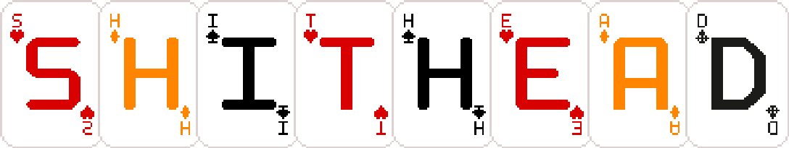

</img>
---
Shithead is a multi player card came written in lua for the framework Love2D

# Project Folder Structure
- root
    - **Docs** - Documentation on game objects and functions
    - **engine** - Base Game objects that help construct the game
        - **base_objects.lua**
        - **event.lua**
        - **functions.lua**
        - **logger.lua**
        - **UI.lua**
    - **librarys** - Helper librarys that help
    - **resources** - Game assets like art and music
    - **shaders** - GPU shader code